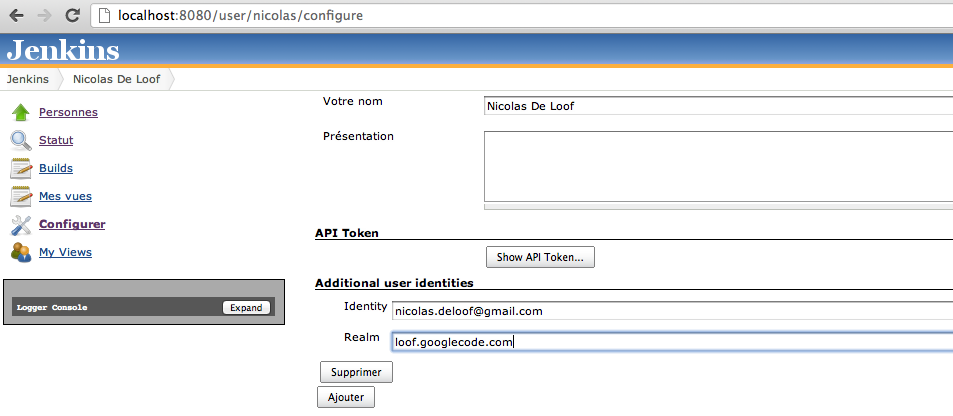

# Additional Identities Plugin for Jenkins

[](https://ci.jenkins.io/job/Plugins/job/additional-identities-plugin/job/main)
[](https://ci.jenkins.io/job/Plugins/job/additional-identities-plugin/job/main/coverage)
[](https://plugins.jenkins.io/additional-identities-plugin)
[](https://github.com/jenkinsci/additional-identities-plugin/releases/latest)
[](https://plugins.jenkins.io/additional-identities-plugin)

This plugin allows user to configure additional identities in jenkins
user database for external services, typically SCM repositories.

## Introduction

As SCM plugin parse changelog, they have to map SCM committers IDs with
jenkins user database. This results in many cases in user duplication,
until you exactly have the same ID in jenkins and SCM.

Jenkins 1.480 introduces an extension point to resolve jenkins user
"canonical" ID when searching for user in Database by id or full name.
This plugin uses this extension point to let user configure external
identities as user properties.

## Usage

On my Jenkins instance, I'm authenticated as "nicolas". As I want to use
the same identity for commits on repositories, I can setup an additional
identity for my account on googlecode :


With this additional identity set, Jenkins will be able to match the
committer id in svn "<nicolas.deloof@gmail.com>" with the jenkins user
"nicolas", and link the builds I contributed to in my user view :


## Realms

As for HTTP authentication, a realm can be set to restrict an identity
to a set of network resources (i.e. domain names in most cases). The
*realm* attribute can be used to restrict the sources user ID matching
will apply. In most cases, this is a substring of the SCM repository
URL. If not set, additional identity applies to all user lookups,
whatever the id source is.

This feature requires SCM plugins to be updated so that they compute
host information form changelog and pass it to extension as
[REALM](http://javadoc.jenkins-ci.org/hudson/model/User.CanonicalIdResolver.html#REALM) context
attribute. Those plugins have been updated to support this advanced
feature :

- TO BE COMPLETED

## Tips

git plugin uses user name, as set in git commit, as committer ID, so you
don't need an additional identity, just ensure your git client is
configured with correct user name set :

``` syntaxhighlighter-pre
git config --global user.name "Your Full Name Comes Here"
```

## Changelog

See GitHub [Releases](https://github.com/jenkinsci/additional-identities-plugin/releases) for newer changes.

### 1.1 (Oct 20 2015)

- [JENKINS-28181](https://issues.jenkins-ci.org/browse/JENKINS-28181)
    NPE thrown in certain cases.
- Internal class rename.
- Missing descriptor error.

### 1.0

- initial release
